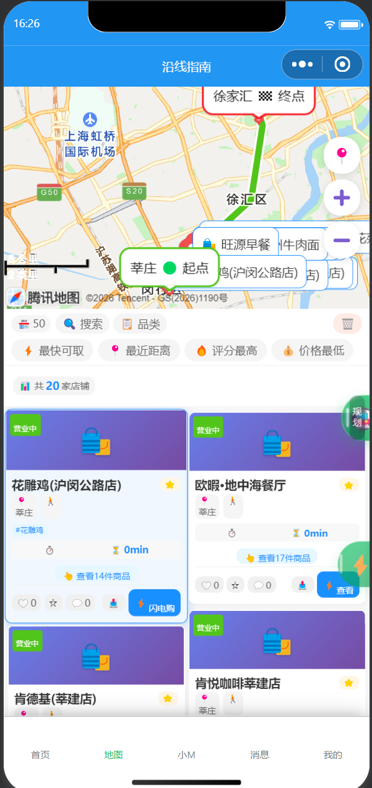
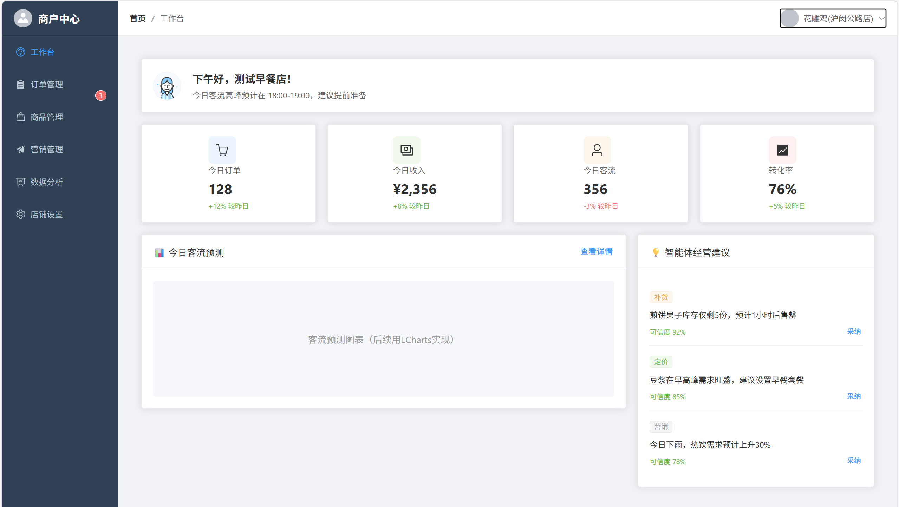
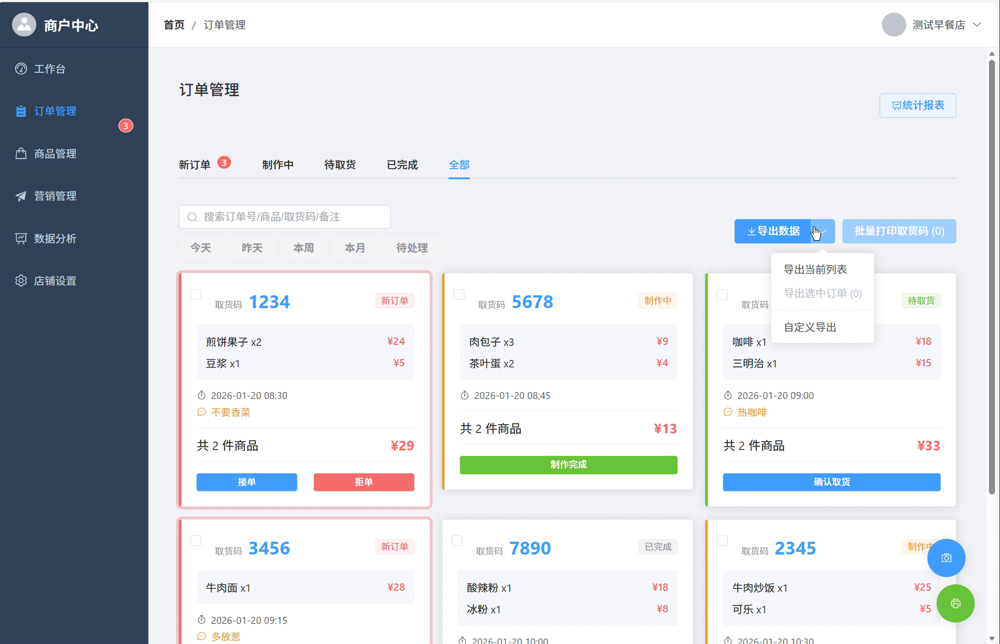
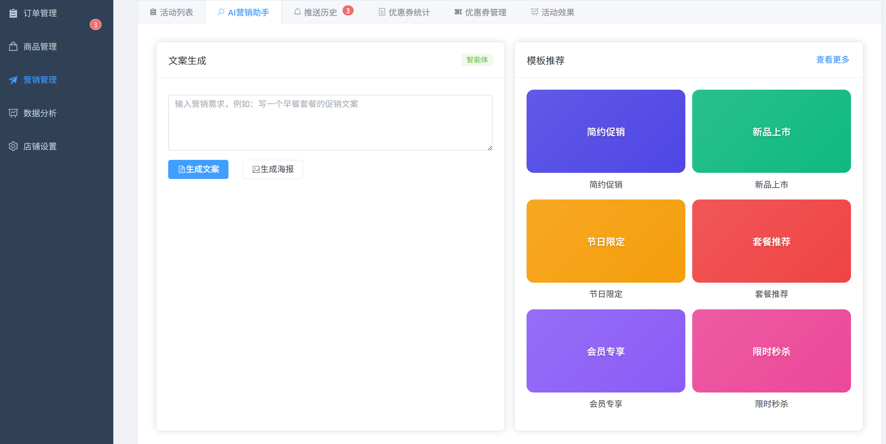
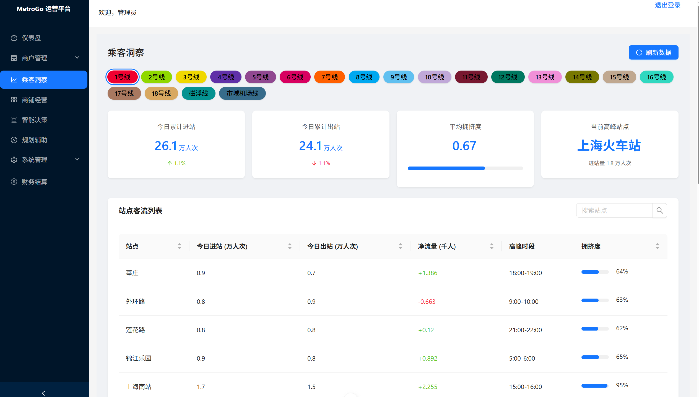
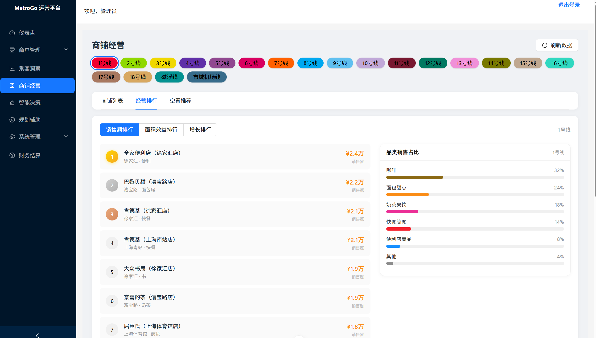
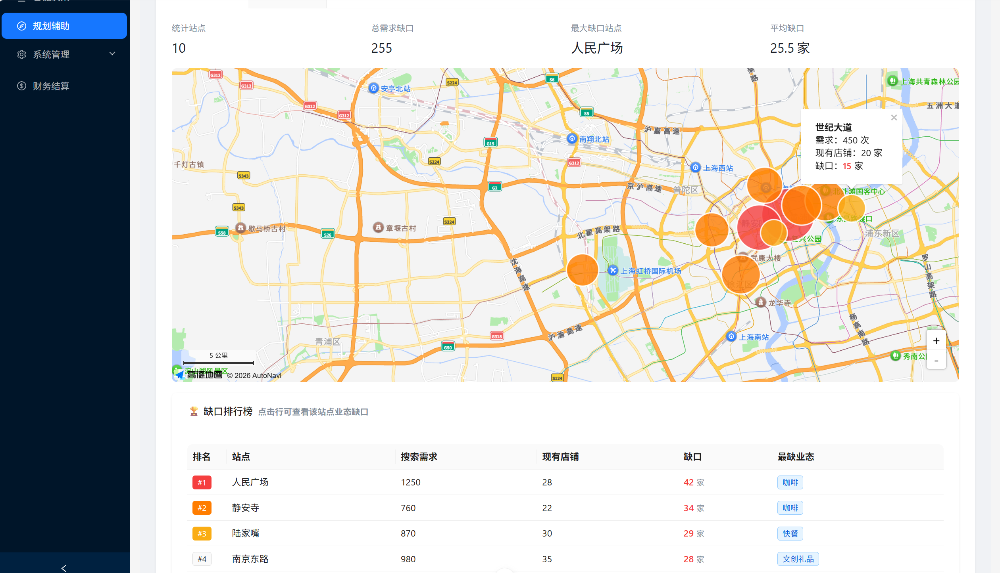

# MetroGo（轨交智购）

面向地铁出行场景的“人顺路取”AI消费平台。

## 项目简介

MetroGo 是一个基于云-边-端三级协同架构的地铁出行 AI 消费平台。用户输入起讫点和购物需求（如“想买咖啡”），系统自动规划 3 条兼顾效率、消费与绿色出行的最优路径，推荐沿途商户，支持在线下单、到站取货。

本项目聚焦地铁场景下市民顺路消费难、小微商户经营难、运营方非票务收入乏力的三重困境，通过云边协同的分布式 AI 架构，打通客流与商流之间的数据壁垒。

## 核心功能

### 乘客端（微信小程序）
- 基于三维评分模型生成 3 条最优路径
- 在线下单、生成取货码、到站取货
- 自然语言输入购物需求（如“从人民广场到陆家嘴，顺路买杯咖啡”）

### 商户端（Web 管理后台）
- 订单管理（接单/制作/核销）
- 商品管理（上架/编辑/库存预警）
- AI 经营建议（销量预测、备货建议、促销文案生成）

### 平台端（Web 管理后台）
- 客流看板（实时客流、分时趋势、需求热力图）
- 商铺经营诊断（经营排行、空置推荐）
- 规划辅助（需求缺口地图、业态缺口分析）

## 技术架构

### 云-边-端三级协同

| 层级 | 部署位置 | 核心任务 |
|------|----------|----------|
| 端侧 | 微信小程序 | 数据采集、界面渲染 |
| 边侧 | 手机本地运行环境 | 关键词过滤、意图识别、动态权重调整（毫秒级响应，弱网可用） |
| 云侧 | 云服务器 + 数据库 | 路径规划、三维评分计算、智能体协同决策 |

### 三维融合路径评分模型
Score = α·S_eff(i) + β·S_con(i) + γ·S_green(i)

其中 α=0.4（效率）、β=0.3（消费）、γ=0.3（绿色）。

- **效率维度**：综合通行耗时 = 基础交通时间 + 绕路进店时间
- **消费维度**：基于距离衰减函数的商户匹配度
- **绿色维度**：路径碳排放量（碳排放因子 0.015kg/公里）

模型输出 3 条帕累托最优路径，体现“辅助决策”而非“替代决策”的设计理念。

### 三大 AI 智能体

| 智能体 | 服务对象 | 核心能力 |
|--------|----------|----------|
| 温暖向导 | 乘客 | 自然语言理解、顺路路径推荐 |
| 经营顾问 | 商户 | 销量预测、库存预警 |
| 营销助手 | 商户 | 促销策略生成、文案创作 |

三大智能体通过数据总线实现协同，形成“需求感知、数据分析、策略生成、精准触达”的智能闭环。

## 技术栈

- **前端**：微信小程序原生、Vue 3 + Element Plus / Ant Design Vue
- **后端**：Node.js + Express
- **数据库**：微信云开发 NoSQL
- **AI 平台**：扣子（Coze）低代码平台
- **地图服务**：高德地图 API（后端）+ 腾讯地图（前端）
- **身份认证**：JWT

## 项目进展

- ✅ 已完成三端（乘客端、商户端、平台端）开发与数据闭环验证
- ✅ 数据库已存储 70+ 商户、700+ 商品数据
- ✅ 路径规划、商品搜索、下单购买等核心功能均已跑通
- ✅ 已完成上海地铁多条线路的站点数据采集与原型测试

## 项目截图

### 乘客端（微信小程序）

| 首页 | 线路规划 | 智能体对话 |
|------|----------|------------|
|  |  |  |

### 商户端（Web管理后台）

| 工作台 | 订单管理 | 营销管理 |
|--------|----------|----------|
|  |  |  |

### 平台端（Web管理后台）

| 乘客洞察 | 商铺经营 | 规划辅助 |
|----------|----------|----------|
|  |  |  |

> 更多功能截图详见 [docs/screenshots.md](docs/screenshots.md)

## 算法说明

详见 [docs/algorithm.md](docs/algorithm.md)

## 开源协议

本项目采用 [MIT License](LICENSE) 开源协议。
