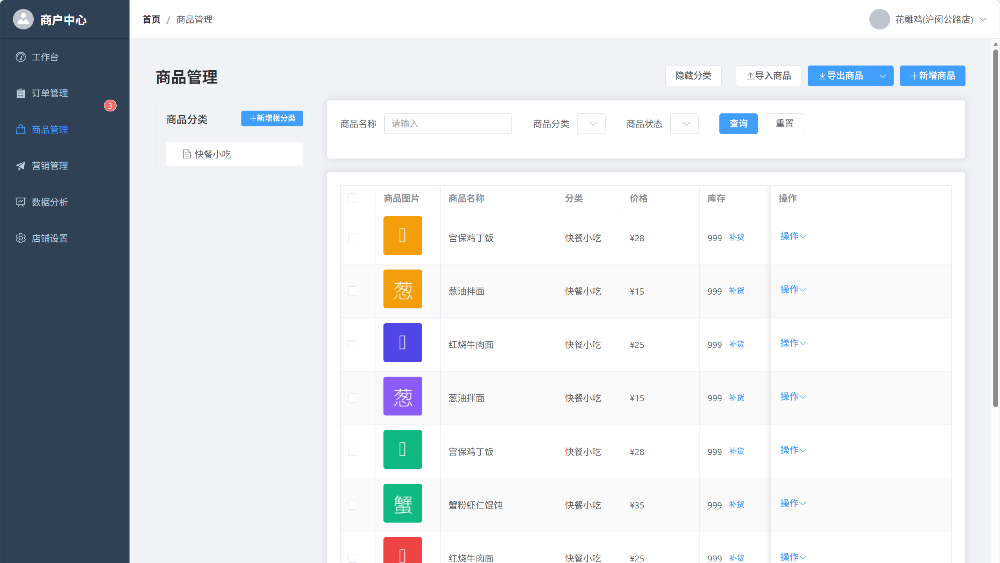

# 项目功能截图

## 乘客端（微信小程序）

### 首页
小程序主入口，集成腾讯地图SDK。用户进入后自动定位至当前位置或默认站点，展示周边店铺标记与今日推荐卡片。包含地图展示、店铺标记、今日推荐卡、快捷入口、实时信息栏、下拉刷新六个功能区域。

### 线路规划
用户输入起点站、终点站和购物需求（如“咖啡”）后，系统生成3条最优路径。路径卡片展示综合耗时（含绕路进店时间）、沿途商户信息及预估碳排放量。点击路线卡片可切换地图路线与店铺列表的联动展示。

### 智能体对话
“温暖向导”智能体与乘客交互的主要入口。支持文字输入或语音输入，理解用户的自然语言购物需求（如“从人民广场到陆家嘴，顺路买杯咖啡”），结合当前起讫点和历史偏好生成顺路购物建议。

### 信息（订单中心）
集中展示商户促销推送和订单状态通知。订单模块下设“全部/进行中/已完成/已取消”子分类，订单卡片展示店铺名称、订单状态、取货码、商品列表、下单时间、总金额。进行中订单可操作“确认取货”。

### 个人中心
提供历史订单查询、优惠券管理、偏好设置（口味偏好、常买品类、通勤线路）等功能。用户可随时修改偏好，智能体据此调整推荐策略。

## 商户端（Web管理后台）

### 工作台首页
商户登录后的经营总览看板，一屏展示今日核心指标（订单数、收入、客流转化率、待处理事项）、客流趋势图、智能体经营建议列表（补货/定价/营销建议，点击“采纳”一键跳转执行），以及快捷操作入口（接单、上架商品）。

### 订单管理
订单列表按状态标签页（新订单/制作中/待取货/已完成/已取消）组织，支持关键词搜索与日期筛选。商户可执行接单、拒单、制作完成、确认取货、扫码核销等操作，支持批量接单、批量打印取货码。新订单到达时通过WebSocket实时推送并伴有提示音。

### 商品管理
页面左侧为分类树，右侧为商品表格（展示图片、名称、价格、库存、状态）。支持新增、编辑、删除、上下架商品，库存低于安全线时自动预警并支持一键补货，支持Excel批量导入导出。

### 营销管理
帮助商户创建促销活动（满减/折扣/买赠/套餐），并通过AI营销助手自动生成多版本文案与海报草稿。活动发布后支持按“全部用户/回头客/新客”定向推送优惠券。

### 数据分析
展示销售趋势、热销商品排行、客流时段分布、竞品对比雷达图及智能体效能报告，支持按日/周/月/自定义时间范围查看，并支持导出经营报表。

### 店铺设置
以Tab切换组织四个配置区域：基础信息（名称、地址、电话）、营业时间（支持多时段配置）、地铁站绑定（与乘客端地图联动）、员工管理（添加/禁用员工并分配角色）、操作日志（记录所有操作行为）。

## 平台端（Web管理后台）

### 仪表盘（运营概览）
展示四个核心指标卡片（入驻商户总数、活跃用户数、今日订单量、营收总额），所有数据实时从云开发数据库读取，为运营人员提供全局视角。

### 商户管理
覆盖商户从入驻到退出的全生命周期管控，包括入驻申请审核（通过/拒绝）、商户账号启用/禁用、商户信息维护。

### 乘客洞察
地铁客流数据分析中心，包含实时客流看板（各站点当前进站人数）、分时客流趋势（过去24小时客流曲线）、需求热力图（热门搜索词云及无结果分析列表，直接指导招商补品方向）。

### 商铺经营
商户经营状况诊断与招商辅助工具，包含商铺列表（浏览/搜索/筛选）、经营排行（按销售额/客流转化等维度排名）、空置推荐（空置铺位列表，附带周边客流热力值与推荐业态）。

### 智能决策
AI辅助决策工具，包含客流预警（配置各站点客流阈值，实时告警）、商铺推荐（空置铺位的智能推荐，含客流潜力与推荐业态）、需求预测（品类搜索热度趋势与未来一周预测）。

### 规划辅助
基于地图的站点规划与业态缺口分析工具，包含需求缺口地图（以高德地图展示各站点需求缺口，气泡大小与颜色映射缺口程度）和业态缺口分析（展示各业态“需求vs供给”对比并生成招商建议）。

### 系统管理
包含三个子模块：管理员管理（账号增删改查、角色分配）、操作日志（全量记录所有操作，支持筛选与导出）、系统参数（客流预警阈值、租金规则、会话超时等业务参数配置，无需改代码即可调整）。

### 财务结算
支撑平台商业化运营，包含统计卡片（待结算商户数、本月应收佣金等）、结算列表（按商户展示结算周期与状态）、生成结算单、提现审核等功能。
