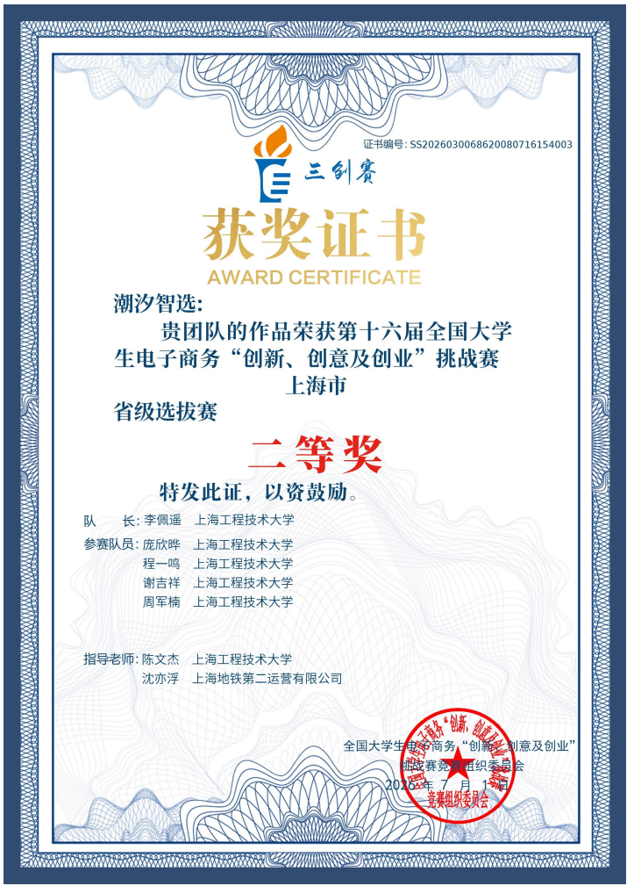
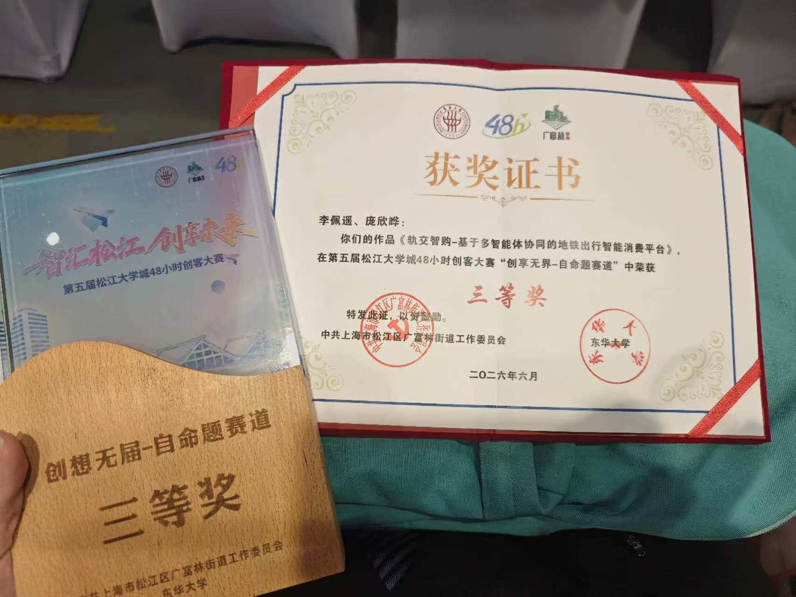
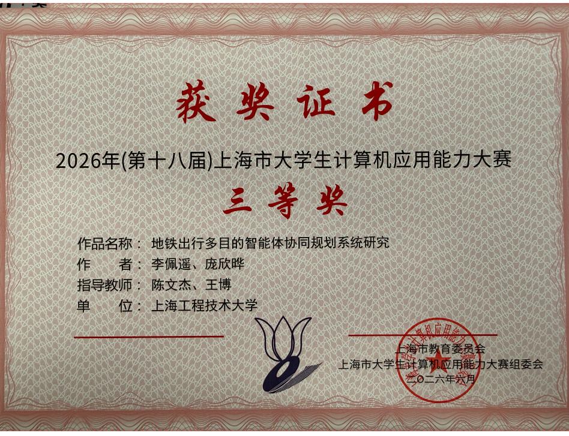
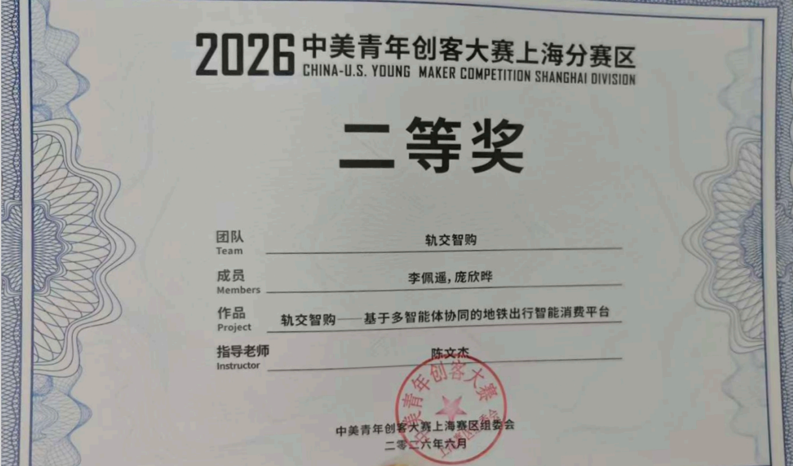
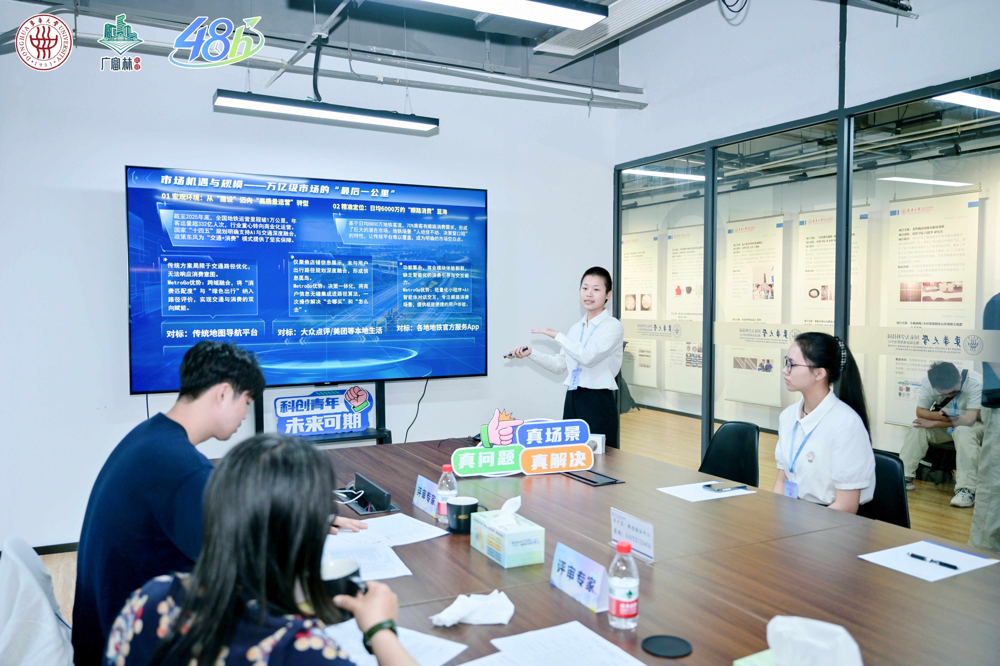
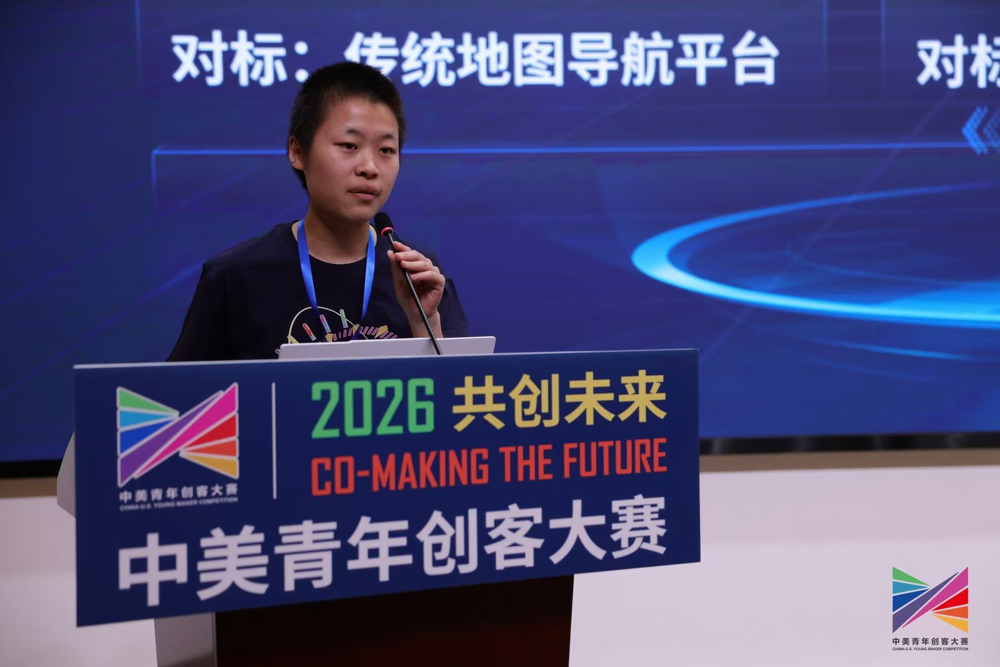
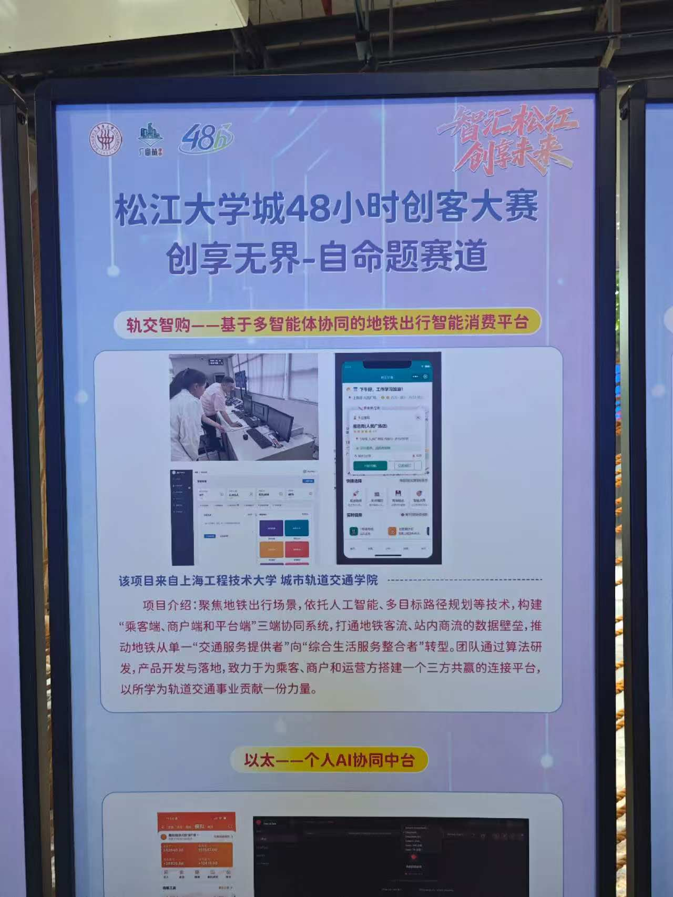
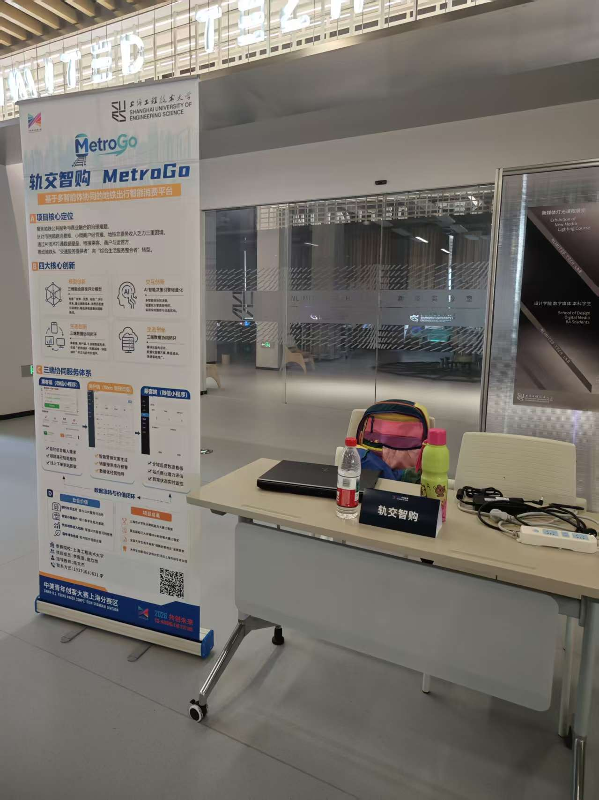
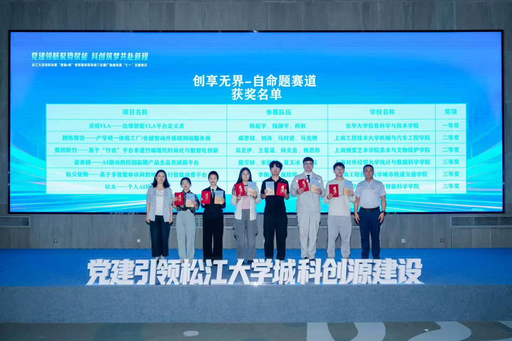

# 获奖与参赛记录

## 获奖证书

### 全国大学生电子商务“创新、创意及创业”挑战赛

省级二等奖

### 上海市大学生计算机能力大赛

三等奖

### 第五届松江大学城48小时创客大赛

三等奖

### 中美青年创客大赛上海分赛区

二等奖

## 参赛照片

### 第五届松江大学城48小时创客大赛答辩现场

### 中美青年创客大赛答辩现场

### 展板展示（一）

### 展板展示（二）

### 团队合影

